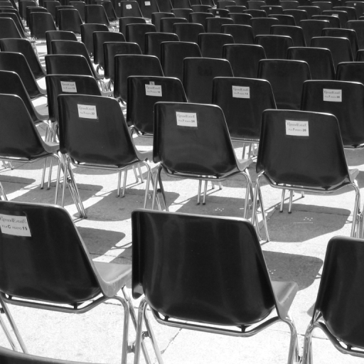
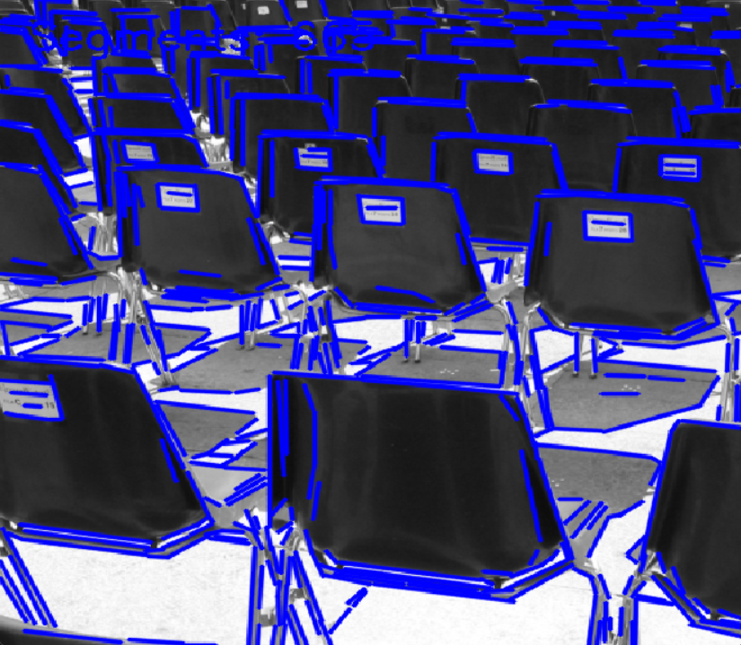
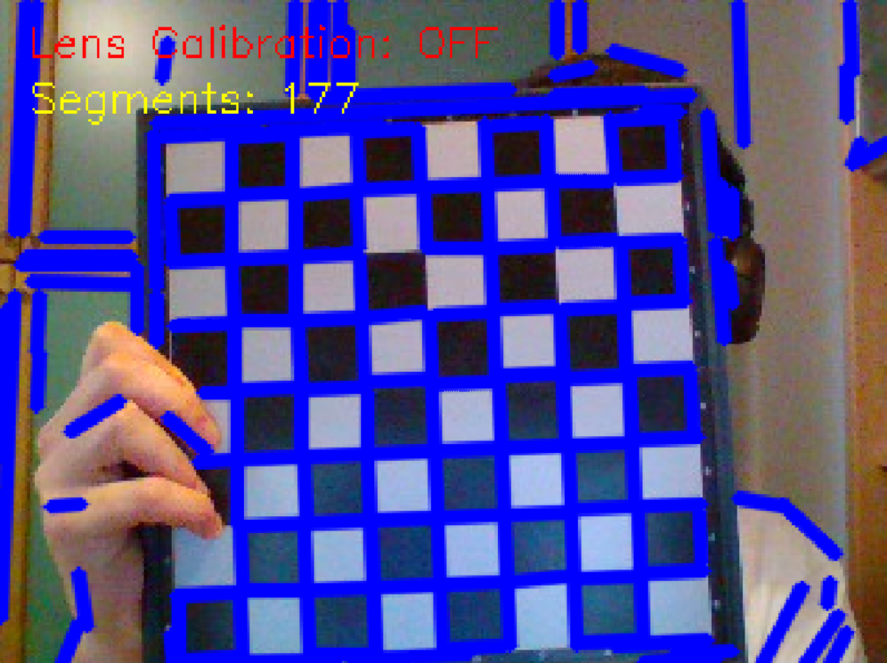

# Line Segment Detector (LSD)

This repository contains a Python implementation of the **LSD (Line Segment Detector)**, an algorithm designed to detect local straight line segments in images with sub-pixel precision and a low rate of false positives.

The algorithm follows the "a contrario" validation approach, ensuring that detected lines are statistically significant and do not occur simply by chance in noise.

## 📖 Background and Reference

This implementation is based on the methodology described in the original paper:

> **Grompone von Gioi, R., Jakubowicz, J., Morel, J.-M., & Randall, G. (2012). LSD: a Line Segment Detector. Image Processing On Line, 2, 35–55.**
> [Read the full article on IPOL](https://www.ipol.im/pub/art/2012/gjmr-lsd/?utm_source=doi)

LSD is designed to work without parameter tuning, providing robust results across different types of images.

---

## ✨ Features

* **Linear Time Complexity:** Uses a pseudo-linear sorting (Bin Sort) for gradient magnitudes to ensure high performance even on large images.
* **Sub-pixel Precision:** Leverages weighted inertia moments to approximate pixel regions with oriented rectangles accurately.
* **A Contrario Validation:** Implements the **Number of False Alarms (NFA)** metric to filter out noise-induced detections.
* **Anti-Aliasing Management:** Includes Gaussian blurring and scaling to mitigate the "staircase effect" on diagonal lines.
* **Dual Execution Modes:**
  - 🎥 Real-Time Mode (Webcam) optimized for speed
  - 🖼 High Precision Mode (Static Image) with full refinement
* **Fast vs Precise Processing:**
  - `fast_mode=True` skips computational refinements for real-time performance
  - `fast_mode=False` applies full optimization as described in the original paper
* **Contrast Enhancement:** Optional histogram equalization improves detection under poor lighting conditions.
* **Camera Calibration Simulation:** Includes optional radial distortion correction to simulate lens calibration effects.
* **Real-Time Visualization:** Displays detected line segments live using OpenCV rendering.
---

## 🛠 Prerequisites

Ensure you have the following Python libraries installed:

```bash
pip install opencv-python numpy scipy
```

## 🚀 How to Use

To use this script, follow these steps:

### 1. Configure the execution mode
Open the script and modify the configuration section:

```python
USE_WEBCAM = False                # True for webcam mode, False for static image
IMAGE_PATH = "images/test.png"    # Path to your image (used only if USE_WEBCAM = False)
```

## 1a. 🎥 Webcam Mode (Real-Time)
Enable webcam mode:

```python
USE_WEBCAM = True
```

### Controls
| Key | Action |
|-----|--------|
| `c` | Toggle camera calibration |
| `q` | Quit the application |

### Behavior
- Runs in **fast mode** (`fast_mode=True`)
- Applies **contrast enhancement** automatically for better performance in low-light conditions
- Detects and draws line segments in real-time
- Displays:
  - number of detected segments
  - calibration status (ON/OFF)

## 1b. 🖼 Static Image Mode (High Precision)
Disable webcam mode:

```python
USE_WEBCAM = False
```

Set your image path:

```python
IMAGE_PATH = "images/your_image.png"
```

### Behavior
- Runs in **precise mode** (`fast_mode=False`)
- Applies full **mathematical refinement**
- Preserves original image contrast
- Produces more accurate and stable detections

## 2. Run the script
Execute the script via terminal

```bash
python lsd.py
```

## 📊 Output & Results
After running the script, the detected line segments are visualized directly on the images using OpenCV.

#### Example Visualization:

| Original Image | Static Mode (High Precision) | Fast Mode (Real-Time) |
| :---: | :---: | :---: |
|  |  |  |

---

### 📌 Observations
- **Static Mode** detects more segments with higher accuracy and better alignment
- **Fast Mode** is optimized for speed and may miss smaller or less prominent segments
- Noise and fine details are better handled in high precision mode

## 🛠 Parameters & Tuning
While the default values are based on the original IPOL publication, the implementation allows tuning several parameters in the `LSD` class constructor:

| Parameter | Default | Description |
| :--- | :--- | :--- |
| `scale` | `0.8` | Resizes the image before processing. Helps reduce aliasing (staircase effect) and noise. |
| `quant` | `2.0` | Bound of the quantization error. Higher values increase robustness to noise. |
| `ang_th` | `22.5` | Gradient angle tolerance (degrees). Controls how "straight" a segment must be. |
| `density_th` | `0.7` | Minimum density of aligned points required to validate a segment. |
| `n_bins` | `1024` | Number of bins used for pseudo-ordering of gradient magnitudes (affects performance). |

---

## 📝 Notes on Implementation
- **Performance vs Accuracy Trade-off:**  
  In real-time (webcam) mode, the resolution is reduced (e.g., **320×240**) and `fast_mode` is enabled to ensure smooth performance and low latency.  
  In contrast, static image mode operates at full precision with refinement steps, prioritizing detection accuracy over speed.

- **Fast vs Precise Pipeline:**  
  The implementation separates a lightweight pipeline for real-time processing and a full pipeline that includes refinement and optimization steps as described in the original paper.

- **Modular Design:**  
  The code is structured in independent components (gradient computation, region growing, validation, refinement), making it easy to extend, modify, or integrate into larger computer vision systems.
